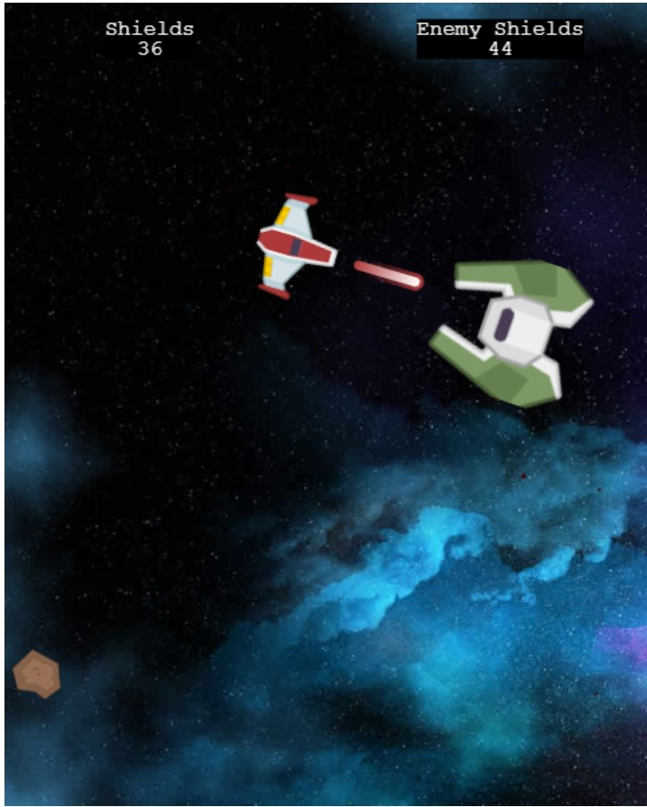

# Space Shooter

> space shooter game created with phaser3

## Built With

- Phaser
- Javascript
- Webpack

## Live Demo

[Live Demo Link](https://natajenkins.github.io/SpaceShooter/)

## Getting Started

**clone repo and run npm install on dir**

### Prerequisites

- NPM
- Webpack
- Node.js

### Setup

**In your terminal you can type the following commands**
**_`git clone git@github.com/NataJenkins/SpaceShooter`_**
**_Next you can type in your terminal `cd spaceshooter` and you will be able to get inside the directory_**

### Install

**_Please after getting in the directory you just downloaded just type in `npm install`_**
**_this will install all of the dependecies for the project_**

### Usage

**In order to run the game just type in npm run start this will open a new web browser and open the game for you You will be taken to the Menu page**

## How to Play the Game

**Once you click on Play , the game will start.**

- **_To play it you can use your mouse to click short clicks will move the ship onto direction, long clicks will shoot a bullet_**

- **survive until the green ship is destroyed**

- **the game ends if your ship get out of shields**

- **Shoot the enemy ship to make damage to it**

## Authors

👤 **Natalia Macias**

- Github: [@natajenkins](https://github.com/natajenkins)
- Twitter: [@natajenkins](https://twitter.com/natajenkins)
- LinkedIn: [Natalia Macias](https://www.linkedin.com/in/Natalia-macias/)

## 🤝 Contributing

Contributions, issues and feature requests are welcome!

## Show your support

Give a ⭐️ if you like this project!

## Acknowledgments

## 📝 License

This project is [MIT](https://github.com/cvilla714/javascriptcapstone/blob/development/LICENSE) licensed.
